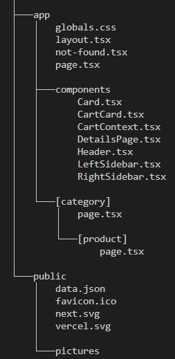

# Internship assignment
## Description
This project is a pre internship assignment developed for company Agilo. It is a responsive e-commerce storefront built using Next.js, React  and Tailwind CSS.
 It allows users to to view a list of all products, filter products by collection in the functional sidebar, visit a product details page to choose among the product variants such as size and color. The user is also able to add items to their cart, view the cart in a right sidebar and remove items as needed.
## Time spent
Over the course of a week, I dedicated 8 to 10 hours a day, approximately 65 hours in total.
## The implementation that was most challenging
Setting up the images based on the selected color was quite challenging. I had to manage numerous variables and locate the correct image corresponding to each color in the JSON file. It required a loto of effort to grasp the logic and implement it correctly.
## The implementation I am most proud of
Creating the cart functionality was initially time-consuming due to the need for setting up a context for managing the cart state. In my previous project, I aimed to develop a similar cart system but lacked the time to implement all the desired features. This time, however, I am thrilled to have finally learned the process of building a comprehensive and functional shopping cart.
## Project structure

## Considerations
1.	State Management: Implemented a centralized state management system using React Context to handle cart operations efficiently.
2.	Data: Given the limited amount of data, I decided to organize it into a JSON file for simplicity and efficiency.
3.	Animations: Enhanced the user experience with personalized animations and integrated ready-made components, including an image slider, Toastify notifications, and hamburger animation.
4.	Error Handling: Developed a custom 404 page to improve navigation and guide users when they encounter non-existent routes.
